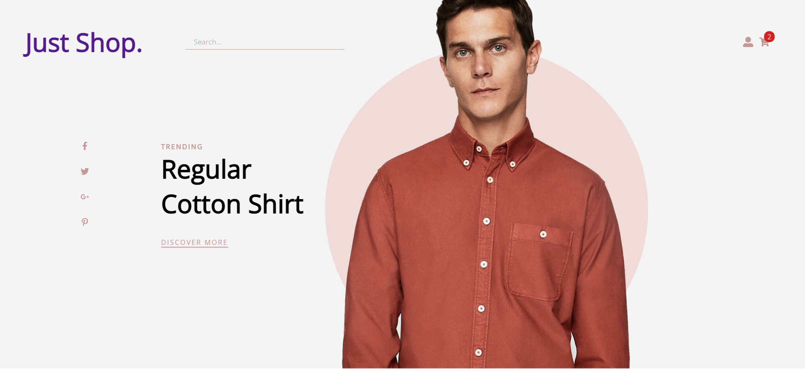

<h1 align="center">Shopping Cart with React/Redux</h1>

<div align="center">
  <h3>
    <a href="https://reduxshoppingcartproject.netlify.app/">
      Demo
    </a>
 
  </h3>
</div>

## Table of Contents

- [Overview](#overview)
- [Built With](#built-with)
- [Features](#features)
- [How to use](#how-to-use)
- [Contact](#contact)

## Overview



### Built With

- React
- Redux
- SASS

## Features

This application is built with React and SASS. For state management 'Redux' is used with 'redux-thunk' and product data is fetched from 'Fakestoreapi'. Persisted data stored at localstorage. Project is still under development, new features will be added.

## How To Use

To clone and run this application, you'll need [Git](https://git-scm.com) and [Node.js](https://nodejs.org/en/download/) (which comes with [npm](http://npmjs.com)) installed on your computer. From your command line:

```bash
# Clone this repository
$ git clone https://github.com/sfkse/ReduxEcomStore

# Install dependencies
$ npm install

# Run the app
$ npm start
```

## Contact

- GitHub [@sfkse](https://github.com/sfkse)
- Linkedin [@sefa Köse](https://www.linkedin.com/in/sefa-köse/)
